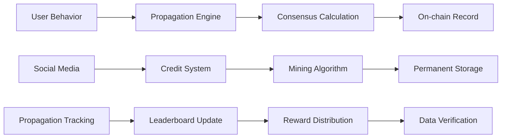

# ModuleX - Bitcoin Protocol


## Project Background & Technical Blueprint

### 💡 Project Overview

ModuleX is a social experiment by Bitcoin fundamentalists, a fission module of Bitcoin's original consensus layer. It is the architecture of belief that Bitcoin needs!

As the first consensus propagation layer (Meme Layer Protocol) built on the Bitcoin network, the ModuleX protocol aims to solve key issues in the current Bitcoin ecosystem: lack of native consensus propagation mechanisms, value symbols for retail investors, and truly replicable viral models for "community structure replication". Through the innovative "propagation-lock-staking" trinity mechanism, ModuleX transforms consensus propagation itself into productivity, making every user a propagation factor (Consensus Carrier).

The project is built on the Casey Runes protocol, running natively on Bitcoin Layer1 without relying on multi-chain compatibility. Through core technical components such as Propagation Engine, Consensus Mining, and Burn Mining, ModuleX has established a complete social credit protocol and propagation incentive mechanism. The globally deployable Propagation Hub network allows every city to become an independent "fire domain", achieving self-organizing replication and fission expansion of communities.

ModuleX is not just a token project, but a protocol-level social consensus mining experiment aimed at proving the core concept that "consensus propagation itself is productivity". Through online and offline promotion strategies, plans are to establish 20-30 city "fire domain nodes" in South Korea, Japan, China, Indonesia, Philippines, Vietnam and other places, promoting the global fission of Bitcoin faith, making consensus no longer hidden in code, but burning in human communities.

- **🏷️ Project Name**: ModuleX  
- **🎯 Project Positioning**: The first consensus propagation layer (Meme Layer Protocol) built on the Bitcoin network  
- **🌟 Core Vision**: Let consensus no longer hide in code, but burn in human communities

**The core technical concepts aim to recognize and build:**

- Bitcoin cannot only carry finance, it must become the narrative ontology
- Bitcoin is the trunk, Runes are tools, but the ModuleX protocol is the fission mental model
- Retail investors are not investors, but propagation factors (Consensus Carrier)

## I. Project Background & Mission

### 💡 1.1 Cosmic Origin Narrative: Cultural and Technical Fission of Bitcoin Ecosystem

After the explosion of Runestone and Runes protocol in 2023, the Bitcoin ecosystem was injected with "cultural assets" for the first time. However, existing assets on Bitcoin still lack three key elements:

1. **Native consensus propagation mechanism** — Lack of spontaneous community propagation momentum
2. **Value symbols for retail investors** — Lack of value carriers that ordinary people can understand
3. **Truly replicable viral models for "community structure replication"** — Lack of scalable community building mechanisms

The birth of the ModuleX protocol is to solve these three fundamental problems.

### 💡 1.2 Founding Team Background

The ModuleX protocol was initiated by three Bitcoin fundamentalists:

- **Max R. Hedlund** (USA/Sweden)
  - Former Open Ordex developer
  - Bitcoin tech geek, focused on Layer1 protocol optimization
- **Thomé Vega** (Indian-American geek)
  - Former Blockstream community architecture consultant
  - Expert in Bitcoin ecosystem design
- **Aya.K** (Former SBF research team member)
  - Expert in Bitcoin visual culture
  - Focused on cryptocurrency user experience design

### 💡 1.3 Core Philosophy

> "Narrative ≠ Story. It's architecture of belief. And Bitcoin needs it."

ModuleX believes that all current BTC ecosystem projects are too "rational" and lack "fire", therefore establishing the ModuleX protocol with the vision: "Let consensus no longer hide in code, but burn in human communities."

> "ModuleX is not just a token, it's a protocol-level experiment in social-consensus mining on the Bitcoin network."

### 💡 1.4 Community Formation & Target Vision

Max R. Hedlund, Thomé Vega, and Aya.K, three Bitcoin fundamentalist tech leaders, created and launched the ModuleX protocol, but as tech geeks, they did not promote it. However, this concept received positive responses from communities in China, Japan, South Korea, Europe, South Asia, and other regions, who began to spontaneously promote it, thus forming a matrix multi-modal community.

In China, we have a large group of Bitcoin fundamentalist believers, and we also believe this will be the next hotspot. For this reason, a group of communities that have successfully cooperated multiple times, adhering to Bitcoin fundamentalism and relying on the beliefs of three tech thinkers, plan to actively promote ecological interaction in community form and establish consensus on great ideas.

## II. Core Logic & Protocol Components

### 💡 2.1 Protocol Technical Architecture

#### 2.1.1 Foundation Protocol Layer

- **Casey Runes Protocol**: Tokens run natively on BTC Layer1, not relying on multi-chain compatibility
- **Bitcoin Layer1 Native**: All functions are built directly on the Bitcoin main chain
- **Runes Core Layer**: All token issuance is based on the new Runes protocol on Bitcoin Layer1

#### 2.1.2 Consensus Propagation Layer

- **Bull Propagation Engine**: Social credit protocol that tracks user propagation behavior, engagement, and staking activity
- **Burn Mining Concept**: No electricity mining required, but generates credits and incentives through "propagation-lock-staking" behavior
- **Fire Domain Structure**: Globally deployable "Propagation Hub" (propagation nodes), replicating and spreading community fire

### 💡 2.2 Logic System (Meme-Layer Vocabulary)

#### 2.2.1 Core Concepts

- **Narrative Mining**: Propagating narratives itself is productivity
- **Propagation Hub**: City-level propagation hub, replicating the Bull model
- **Burn Mining**: Activate network consensus through social fission, staking, and interaction
- **Meme Amplifier**: Leaderboard + propagation credit system forms community-driven structure

#### 2.2.2 Technical DNA

ModuleX is a protocol with technical DNA: **BTC + Runes + Consensus Propagation Layer**.

It is the first protocol-level experiment built on Bitcoin Layer1 Narrative, with "consensus-driven propagation" as its core.

### 💡 2.3 Module Factors & Corresponding Functions

| Module                        | Function Description                                                                                                         |
| ----------------------------- | ---------------------------------------------------------------------------------------------------------------------------- |
| Consensus Mining              | Users accumulate fire seed credits through society/propagation/holding tokens, enter leaderboards, forming GameFi-style propagation structure |
| Runes Anchoring               | Core tokens will be issued on the Runes protocol, ensuring Layer1 native properties                                          |
| Autonomous Community Replication | Each joining team can fork a sub-fire seed branch and self-organize through the same mechanism                                |

## III. Technical Architecture Details

### 💡 Overall Technical Architecture Diagram

| Layer                             | Components                                                                                  |
| --------------------------------- | ------------------------------------------------------------------------------------------- |
| Layer 3: Application Ecosystem    | Propagation Hub • Community Tools • Analytics Tools • Third-party Apps                      |
| Layer 2: Consensus Propagation    | Propagation Engine • Consensus Mining • Meme Amplifier • Burn Mining System                 |
| Layer 1: Bitcoin Foundation       | Bitcoin Network • Runes Protocol • Ordinals Protocol • Lightning Network                    |

### 💡 3.2 Three-Layer Architecture Design

#### 3.2.1 Layer1 - Bitcoin Foundation Layer

- **Native Runes Tokens**: Issued based on Casey Runes protocol
- **On-chain Data Storage**: All propagation behaviors recorded on Bitcoin main chain
- **Immutability**: Ensures authenticity and transparency of consensus propagation

#### 3.2.2 Layer2 - Consensus Propagation Layer

- **Propagation Engine**: Propagation behavior tracking engine
- **Credit System**: Reward mechanism based on propagation behavior
- **Leaderboard System**: Community-driven incentive mechanism

#### 3.2.3 Layer3 - Application Ecosystem Layer

- **Propagation Hub**: Global propagation node network
- **Community Tools**: Propagation, preaching, staking and other tool sets
- **Ecosystem Applications**: Third-party applications built on ModuleX protocol

### 💡 3.3 Core Technical Components

#### 🔗 Runes Protocol Integration

```javascript
const runeToken = {
  name: "MODULEX",
  symbol: "MXL",
  decimals: 18,
  totalSupply: "1000000000",
  protocol: "Casey Runes",
  network: "Bitcoin Layer1"
};

function mintRuneToken(amount, recipient) {
  const runeData = {
    protocol: "runes",
    operation: "mint",
    amount: amount,
    recipient: recipient,
    metadata: {
      name: "ModuleX Consensus Token",
      description: "Bitcoin Consensus Propagation Token"
    }
  };
  return bitcoinTransaction(runeData);
}
```

#### ⚡ Propagation Engine Architecture

```rust
use std::collections::HashMap;
use std::time::{SystemTime, UNIX_EPOCH};
use serde::{Deserialize, Serialize};

#[derive(Debug, Clone, Serialize, Deserialize)]
pub enum ActionType {
    Share,
    Like,
    Comment,
    Hold,
    Invite,
}

#[derive(Debug, Clone, Serialize, Deserialize)]
pub struct PropagationAction {
    pub user_id: String,
    pub action_type: ActionType,
    pub content_hash: String,
    pub timestamp: u64,
    pub block_height: u64,
}

pub struct PropagationEngine {
    user_actions: HashMap<String, Vec<PropagationAction>>,
    propagation_scores: HashMap<String, u64>,
    consensus_metrics: HashMap<String, f64>,
}

impl PropagationEngine {
    pub fn new() -> Self {
        Self {
            user_actions: HashMap::new(),
            propagation_scores: HashMap::new(),
            consensus_metrics: HashMap::new(),
        }
    }
    
    pub fn track_propagation_action(
        &mut self,
        user_id: String,
        action_type: ActionType,
        content_hash: String,
    ) -> Result<(), Box<dyn std::error::Error>> {
        let timestamp = SystemTime::now()
            .duration_since(UNIX_EPOCH)?
            .as_secs();
        
        let action = PropagationAction {
            user_id: user_id.clone(),
            action_type: action_type.clone(),
            content_hash,
            timestamp,
            block_height: self.get_current_block_height()?,
        };
        
        let score = self.calculate_propagation_score(&action);
        self.update_user_score(&user_id, score);
        
        self.record_to_bitcoin(&action)?;
        
        Ok(())
    }
    
    fn calculate_propagation_score(&self, action: &PropagationAction) -> u64 {
        match action.action_type {
            ActionType::Share => 10,
            ActionType::Like => 2,
            ActionType::Comment => 5,
            ActionType::Hold => 1,
            ActionType::Invite => 20,
        }
    }
    
    fn update_user_score(&mut self, user_id: &str, score: u64) {
        *self.propagation_scores.entry(user_id.to_string()).or_insert(0) += score;
    }
    
    fn get_current_block_height(&self) -> Result<u64, Box<dyn std::error::Error>> {
        Ok(0)
    }
    
    fn record_to_bitcoin(&self, _action: &PropagationAction) -> Result<(), Box<dyn std::error::Error>> {
        Ok(())
    }
}
```

#### ⛏️ Consensus Mining Algorithm

```python
class ConsensusMining:
    def __init__(self):
        self.consensus_pool = {}
        self.mining_difficulty = 1000
    
    def mine_consensus(self, user_id, propagation_data):
        user_activity = self.get_user_activity(user_id)
        difficulty = self.calculate_difficulty(user_activity)
        
        consensus_proof = self.generate_consensus_proof(
            user_id,
            propagation_data,
            difficulty
        )
        
        if self.verify_consensus_proof(consensus_proof):
            return self.reward_consensus_mining(user_id, consensus_proof)
        
        return None
```

### 💡 3.4 Smart Contract Architecture

#### 📜 Propagation Reward Contract

```solidity
contract PropagationReward {
    struct User {
        uint256 propagationScore;
        uint256 consensusTokens;
        uint256 lastMiningTime;
        mapping(bytes32 => bool) actions;
    }
    
    mapping(address => User) public users;
    uint256 public totalPropagationScore;
    
    event PropagationAction(
        address indexed user,
        bytes32 indexed actionHash,
        uint256 score,
        uint256 timestamp
    );
    
    function recordPropagationAction(
        bytes32 actionHash,
        uint256 score
    ) external {
        require(!users[msg.sender].actions[actionHash], "Action already recorded");
        
        users[msg.sender].actions[actionHash] = true;
        users[msg.sender].propagationScore += score;
        totalPropagationScore += score;
        
        emit PropagationAction(msg.sender, actionHash, score, block.timestamp);
    }
}
```

### 💡 Data Flow Architecture



### 💡 3.6 Core Technical Features

#### 3.6.1 Consensus Propagation Mechanism

- **Propagation Credits**: Users earn credits through sharing and preaching
- **Staking Incentives**: Long-term holders receive additional rewards
- **Community Contribution**: Users who contribute to the community receive recognition

#### 3.6.2 Self-organizing Community Structure

- **Fire Seed Branches**: Each city/region can establish independent propagation nodes
- **Autonomous Management**: Each node has independent management rights
- **Unified Standards**: All nodes follow the same propagation protocol

#### 3.6.3 Viral Propagation Model

- **Propagation Factors**: Every user is a propagation factor (Consensus Carrier)
- **Fission Mechanism**: Achieve exponential propagation through social networks
- **Value Symbols**: Simple and understandable value carriers, easy to propagate

---

**Disclaimer:** This document is for informational reference only and does not constitute investment advice. Cryptocurrency investment involves high risks, please make investment decisions carefully.

Document Version: v2.0  
Last Updated: July 15, 2025  
Document Maintenance: ModuleX Core Team
